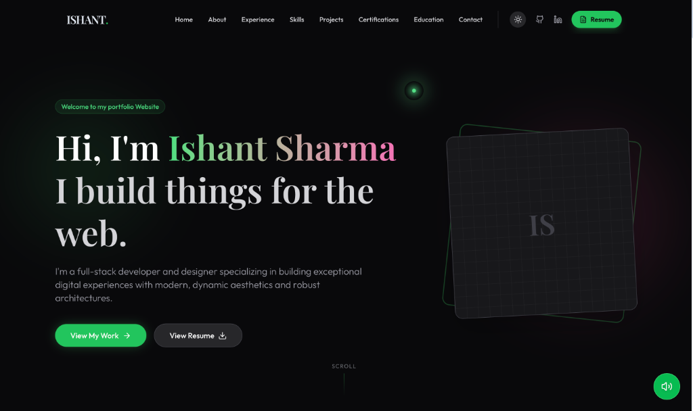
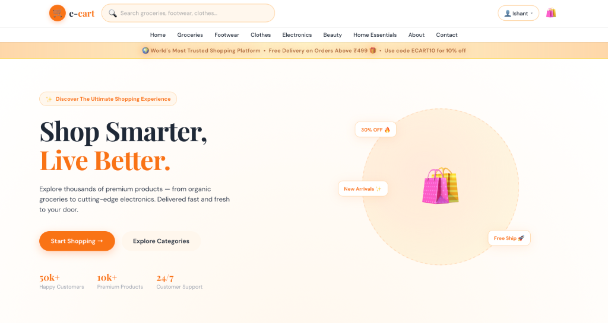
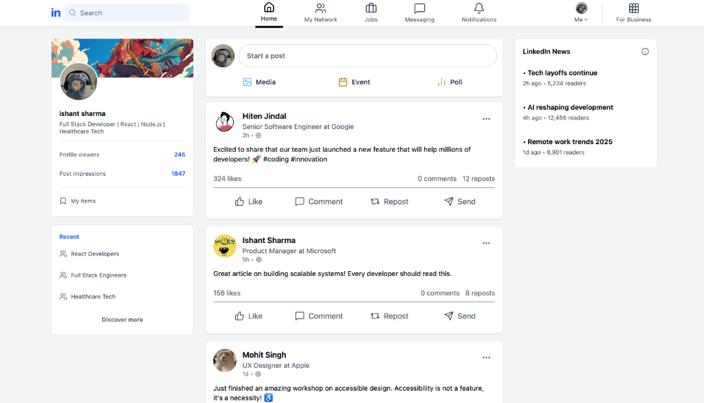
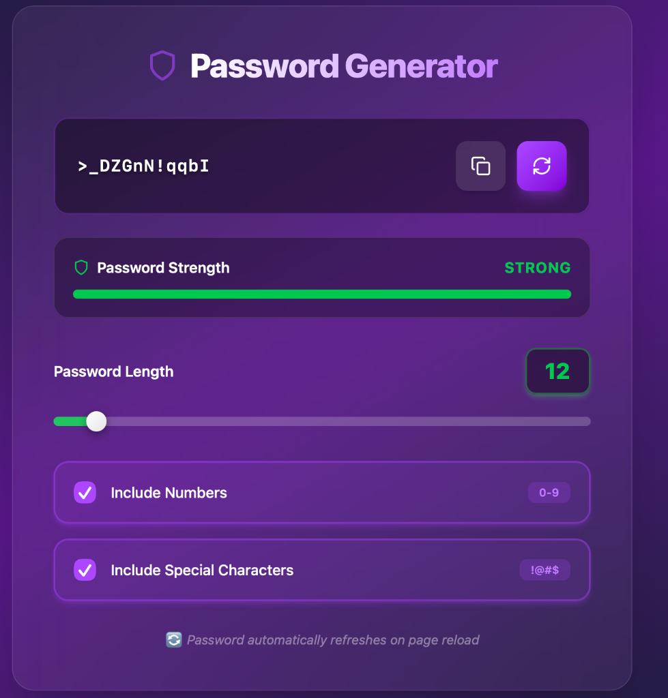
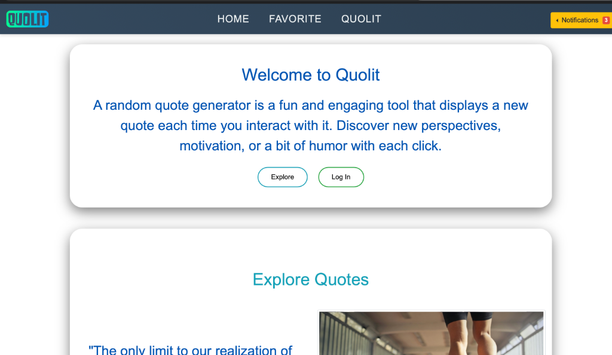

# 🚀 Ishant Sharma's 3D Interactive Portfolio

Welcome to the central repository for my interactive, 3D-driven personal portfolio website. This project merges modern UI engineering with glassmorphism aesthetics, fluid framer-motion animations, and highly performant component architecture to deliver a truly immersive user experience.

---

## 🛠️ Technology Stack

This application is built leveraging industry-standard modern frontend tooling:

*   **Core Framework**: [React 19](https://react.dev/)
*   **Build Tool**: [Vite](https://vitejs.dev/) - Lightning-fast HMR and optimized builds
*   **Styling**: [Tailwind CSS v4](https://tailwindcss.com/) - Utility-first CSS framework for custom styling
*   **Animations**: [Framer Motion](https://www.framer.com/motion/) - Complex layout animations and interactive states
*   **3D Interactive Effects**: [React Parallax Tilt](https://www.npmjs.com/package/react-parallax-tilt) - Used for the glowing glass cards
*   **Icons**: [Lucide React](https://lucide.dev/) - Clean, consistent iconography

---

## 📁 Project Structure

```text
Portfolio-Website/
├── frontend/
│   ├── public/                 # Static assets
│   │   └── images/
│   │       ├── profile.png     # Site Hero picture
│   │       └── projects/       # Stored preview images 
│   ├── src/
│   │   ├── components/         # Modular UI Components
│   │   │   ├── About.jsx       # About me and DSA stats
│   │   │   ├── Achievements.jsx# Milestones tracking
│   │   │   ├── AudioPlayer.jsx # Background audio logic & Modals
│   │   │   ├── Certifications.jsx
│   │   │   ├── Contact.jsx
│   │   │   ├── CustomCursor.jsx# Custom 3D cursor tracking
│   │   │   ├── Education.jsx
│   │   │   ├── Experience.jsx
│   │   │   ├── Footer.jsx
│   │   │   ├── Hero.jsx        # Landing top-half
│   │   │   ├── Navbar.jsx
│   │   │   ├── Projects.jsx    # Project mapping with Tilt previews
│   │   │   └── Skills.jsx      # Animated Technical Toolkit
│   │   ├── App.jsx             # Root layout wrapper
│   │   ├── index.css           # Global custom CSS tokens
│   │   └── main.jsx            # React Initialization
│   ├── index.html
│   ├── package.json
│   └── vite.config.js
└── README.md                   # You are here!
```

---

## 📸 Featured Work & Previews

A huge part of this portfolio is showcasing technical projects. Here are the core applications featured on the site:

### 1. Portfolio Website (This Repository)
The portfolio itself serves as the hallmark project. Demonstrates complex animations, hover effects, light/dark mode persistence, and custom modal layouts.


### 2. E-Cart
A full-stack e-commerce simulation platform featuring shopping carts, JWT authentication, and product dashboards.


### 3. LinkedIn Clone
A functional clone of LinkedIn bringing modern UI/UX practices to a professional social network application model.


### 4. Password Generator & Checker
A robust utility script interface allowing users to generate complex passwords and verify existing ones against security parameters.


### 5. Random Quote Generator
A minimalist, API-fed quote engine that seamlessly pulls motivational snippets.


---

## 🏃‍♂️ Getting Started Locally

To run this portfolio website strictly on your local machine:

1.  **Clone the Repository**:
    ```bash
    git clone https://github.com/CipherCraftXIshant/Portfolio-Website.git
    cd Portfolio-Website/frontend
    ```

2.  **Install Dependencies**:
    ```bash
    npm install
    ```

3.  **Spin Up the Dev Server**:
    ```bash
    npm run dev
    ```

4.  **View the Magic**: Open [http://localhost:5173/](http://localhost:5173/) in your browser.
